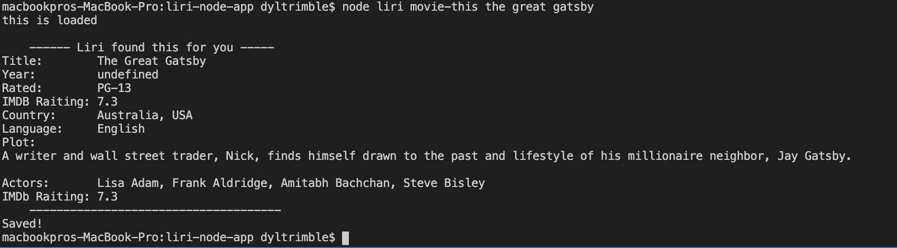

# liri-node-app

LIRI is a Language Interpretation and Recognition Interface.
Use LIRI to get your latest tweets, find out about a song,
or a movie, or just choose a random action from your own random file.

## Installs

The [package.json](https://github.com/Meggin/liri-node-app/blob/master/package.json)
lists dependent node packages, but for your convenvice, these are the ones to install.

   * [Node-Spotify-API](https://www.npmjs.com/package/node-spotify-api)

   * [Axios](https://www.npmjs.com/package/axios)

     * You'll use Axios to grab data from the [OMDB API](http://www.omdbapi.com) and the [Bands In Town API](http://www.artists.bandsintown.com/bandsintown-api)

   * [Moment](https://www.npmjs.com/package/moment)

   * [DotEnv](https://www.npmjs.com/package/dotenv)

You will need your own keys for spotify, omdb, and bands in town. you will need to add your spotify keys to your own .env file.

## Get Started

Here's a quick rundom of the commands you can use in LIRI.

### Get Song Info

Retrieves song information for a track:

`node liri.js spotify-this-song came out swinging`

### Get Movie Info

Retrieves movie information for a movie:

`node liri.js movie-this the great gatsby`

### Get Tour Info

Retrieves tour dates and venue information:

`node liri.js bands-in-town rainbow kitten surprise`

### Get Random Info

Gets random text inside a file and does what it says:

`node liri.js do-what-it-says`

### Log it all

Finally it logs your results to a log.txt file:

